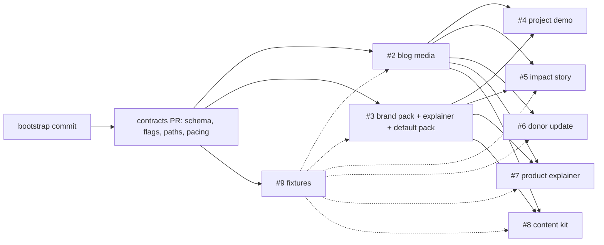

# #1 [Epic]: Content engine skills: one piece of writing to images, audio and video: context

This dossier covers the whole epic: the repo, packaging, licensing, shared config, the cross-skill contracts, conventions and the dependency graph. Per-skill detail is in [issue-2.md](issue-2.md) through [issue-9.md](issue-9.md).

**Shared defaults (2026-09-29).** The epic and the #2–#9 dossiers disagreed on several shared points. This dossier settles them with one default each:
- license (Decision 1);
- brand-pack schema (6) and who ships the default pack (7);
- output and pack locations (8);
- CLI flags (9);
- narration pacing (10);
- #4 test repos (20).

It also covers how a plugin gets its npm dependencies (Dependencies; Decision 3).

**Citation shorthand.**
- `app:` is the vets-who-code-app repository at `b7c19088`. `origin/master` is `badc2951`, 20 commits ahead (`git rev-list --count`).
  - No file under `scripts/` or `__tests__/scripts/` differs between the two.
  - `package.json` does differ: #1460 bumps `@google/genai` from 1.40.0 to 2.24.0.
  - `src/lib/blog.ts` differs by 1 line: `getPostBySlug` drops a JSON round-trip at :50.
  - Source for all three: `git diff HEAD origin/master`.
- `vfe:` is `~/.claude/skills/vwc-faceless-explainer`.
- `sk:` is `~/.claude/skills`.
- `dz#N` is docs/context/issue-N.md, the sibling dossier for hs#N, linked as [issue-N.md](issue-N.md).
- `cc:` is `https://code.claude.com/docs/en/`.
- `hs#N` is a hashflag-skills issue. A bare `#N` is a vets-who-code-app PR or issue.
- All reads were done on 2026-09-29.

---

## What exists today

### The target repo
- `Vets-Who-Code/hashflag-skills` is private, `size 0`, `license null`, created 2026-09-26T18:41:20Z (`gh api repos/Vets-Who-Code/hashflag-skills`).
- It has no commits. GET /commits returns 409 "Git Repository is empty". GraphQL `defaultBranchRef` is `null`, while REST still reports `default_branch: main` (gh api; GraphQL).
- Description, verbatim with its typos: "a repository of skills and agents made at Vets Who COde that helps our nonprofit build and and operate straight from the terminal.." (gh api).
- Issues #1–#9 are all open, with no comments, assignees or milestones. #1–#8 are labeled `enhancement`. #9 is labeled `documentation` and `good first issue` (gh issue list).
- #1 has 7 sub-issues (#2–#8). #9 has `parent: null` (GraphQL subIssues/parent).
- Issue bodies use the app's task-template headings. Only a `[Task]` template exists (app:.github/ISSUE_TEMPLATE/task.md). The org `.github` repo has no ISSUE_TEMPLATE (gh api repos/Vets-Who-Code/.github/contents).

### Engine 1: blog media (app:scripts)
| Path | Lines | What it does |
|---|---|---|
| app:scripts/generate-blog-image.ts | 250 | The steps, in order:<br>1. `gemini-3.1-pro-preview` returns a theme JSON.<br>2. The theme fills fixed templates.<br>3. `gemini-3-pro-image` renders the image.<br>4. A check looks for text in the image.<br>5. The image uploads to Cloudinary `blog-images/<slug>` (file; #1266).<br><br>Imports `dotenv/config`, `@google/genai`, `@/lib/cloudinary` and `./image-prompts` with no extension (:1-6). |
| app:scripts/image-prompts.ts | 69 | 3 fixed 1950s linocut/WPA prompt templates. They hard-code VWC colors: "Use only Navy Blue (#091f40), Red (#c5203e), and White (#ffffff)" (:14,55). |
| app:scripts/generate-single-blog-audio.ts | 344 | Steps: strip Markdown, chunk, Gemini TTS, PCM→WAV, loudness normalize, upload to Cloudinary `blog-audio/<slug>`.<br><br>Exports `pcmToWav` :6, `main` :154, `NARRATION_STYLE` :240, `normalizeLoudness` :247, `chunkForTts` :298, `cleanMarkdownToText` :327 (grep `export`). |
| app:scripts/generate-blog-graphic.ts | 142 | Gemini-drafted HTML artboards, rendered by Playwright to PNG and uploaded to `blog-graphics/<folder>-<name>`.<br><br>Has `--draft` and `--dry` (local render, no upload). Imports `playwright` (:5), which is not a declared dependency, plus `@/lib/cloudinary` (:6). |
| app:scripts/generate-blog-media.ts | 92 | Runs image, then audio, each in its own try/catch. Exits 1 if either fails (:83,90). |
| app:scripts/lib/cloudinary.ts | 11 | Standalone Cloudinary config with no `@/` alias (#959). No file imports it (grep). |
| app:scripts/generate-blog-audio-overviews.ts, upload-blog-audio.js, upload-audio-to-cloudinary.ts | – | Legacy: no chunking, no normalization, no invalidate. Running them would overwrite the good Cloudinary copies. Do not port (`ls scripts`; research). |
| app:__tests__/scripts/*.test.ts | 553 total, 524 of them blog media | `tts-chunking` 84, `generate-blog-image` 154, `generate-single-blog-audio` 149, `generate-blog-media` 112, `generate-blog-graphic` 25 (`wc -l`).<br><br>The sixth file, `generated-at` (29 lines, by Jinu), tests `scripts/lib/generated-at`, a taxonomy-generator helper. It is not blog media (file:1).<br><br>`tts-chunking` imports only `chunkForTts`, `cleanMarkdownToText` and `normalizeLoudness`. It imports them from the script, and the script imports `@/lib/cloudinary` (file:1-6; script:3). So it ports only after Lesson #12's alias removal. |
| app:src/lib/blog.ts:55-59 | – | The site derives the audio URL as `https://res.cloudinary.com/<cloud>/video/upload/f_mp3/blog-audio/<slug>.wav` (fallback cloud `vetswhocode`). 0 of 39 posts have an `audio:` key (grep). |
| app:src/lib/cloudinary.ts:1-9 | 327 | Configures Cloudinary at import time from `NEXT_PUBLIC_CLOUDINARY_CLOUD_NAME`, `CLOUDINARY_API_KEY` and `CLOUDINARY_API_SECRET`. This is what the scripts actually import (generate-blog-image.ts:5). |
| app:src/data/blog-graphics/_brand.css | – | Artboard style contract. Artboards are 1400x760, screenshotted at deviceScaleFactor 2 (research). |
| app:src/pages/api/og.tsx | – | Deterministic text-card rendering. Prior art for text-bearing social images in #5 and #8 (research). |
| app:src/data/outcomes.ts | – | Typed outcome stats with value, display, qualifier, source and asOf, plus a Vitest scan for stray copies (#1418). Prior art for "facts come from the source". |
| app:src/data/blogs/ai-as-infrastructure-audio-pipeline.md | 713 words | VWC's public write-up of the pipeline. A README seed and a one-chunk test post (research). |
| app:README.md:184-221 | – | Human docs for blog media (b7c19088). |

### Who wrote the code being ported (licensing input for Decision 1)
| File | Raw `git blame` | `git blame -w -M -C` (whitespace-blind, follows moves) | Where the lines came from |
|---|---|---|---|
| generate-blog-image.ts (250) | Brad Hankee 237, Jerome Hardaway 13 | Brad 238, Jerome 12 | Brad: 7b0f4aef (#959) and c290a2fc (#1007). Jerome: 1fa1bfa7 (#1266) and caef1b5e (#974) |
| image-prompts.ts (69) | Brad 69 | Brad 69 | c290a2fc (#1007) |
| scripts/lib/cloudinary.ts (11) | Brad 11 | – | 7b0f4aef (#959) |
| generate-single-blog-audio.ts (344) | Brad 177, Jerome 141, Stephen Clark 26 | 4243651d "Stephen" 136, Jerome 1fa1bfa7 133, 9abfecfd "Stephen" 39, Brad 35, Jerome caef1b5e 1 | See the notes below this table |
| generate-blog-media.ts (92), generate-blog-graphic.ts (142) | Jerome, all lines | – | – |
| Tests | – | – | `tts-chunking` 84, `generate-blog-media` 112, `generate-blog-graphic` 25: Jerome. `generate-blog-image` 154, `generate-single-blog-audio` 149: Brad. `generated-at` 29: Jinu, not ported |

Notes on the audio script (344 lines):
- **Most of the file is Jerome's work, despite what blame says.** It was added with 206 lines by commit 9cc6259f, authored by `jeromehardaway` inside PR #948. #948 was squash-merged as 4243651d under Stephen Clark's name. Stephen's own commit in that PR, f449a552, doesn't touch the file (gh api pulls/948/commits and commits/&lt;sha&gt;).
- **Stephen's other attributed lines are formatter output.** 9abfecfd is his Biome migration (#954, 464 files). Its diff here changes only quotes, indentation and import order (`git show 9abfecfd`).
- **Most of Brad's 177 raw lines are re-indentation from 7b0f4aef.** 35 lines survive whitespace-blind blame. They include `cleanMarkdownToText`, the `uploadToCloudinary` and `pcmToWav` signatures, and the `require.main` guard.
- **Inference:** none of Stephen's attributed lines in the ported files are his authored code.
- **PR authorship:** every commit in #959 (24) and #1007 (7) is authored by `bradhankee` (gh api pulls/&lt;n&gt;/commits).

The license terms in force when this code landed:
- #948 merged 2026-02-07, #959 on 2026-02-13 and #1007 on 2026-03-10. At all three dates the repo had no LICENSE file; a070b3bf (#477, 2023-08-04) had deleted it.
- The README said "This project is under the MIT License", linking to `vwc-site/blob/master/LICENSE` (`git show 7b0f4aef:README.md` :4-5, :129-131). `vwc-site` now redirects to vets-who-code-app (`gh api repos/Vets-Who-Code/vwc-site` → full_name `Vets-Who-Code/vets-who-code-app`).
- The last LICENSE text before the deletion was "The MIT License (MIT) Copyright (c) 2018 VetsWhoCode" (`git show a070b3bf^:LICENSE`).
- GPL-3.0 arrived on 2026-04-05 (b56970fb, #1027) and AGPL-3.0 on 2026-09-27 (47165207, #1437).
- #1437 says: "The license change applies going forward. Code already released under earlier terms stays available under those terms" (PR #1437 body).

### Engine 2: brand-locked explainer (`vfe:`, not version-controlled; `git rev-parse` fails there)
| Path | Lines | What it does |
|---|---|---|
| vfe:SKILL.md | 304 | Thin wrapper over upstream `faceless-explainer`. It overrides upstream Steps 1, 2 (skipped), 3 and 6. Frontmatter includes `user-invocable: true` (:1-5). |
| vfe:brand/frame.md | 439 | Hand-written design spec that must never be regenerated (hs#3; owner decision). It bans pure white: "`#FFFFFF` is out of the system" (:187-188). |
| vfe:brand/caption-skin.html | 225 | Caption skin. It differs from upstream broadside only in 2 font fallbacks and uppercase (research). |
| vfe:scripts/check-copy.mjs | 201 | The only copy gate on disk: 15 regex rules as `[regex, replacement]` pairs (:34-37), a span-scoped allowlist, a figures list and 23 self-checks (research). |
| vfe:brand/fonts/ | – | Commercial Gilroy and GothamPro `.woff2`, byte-identical to app:public/fonts. Also JetBrains Mono 400/700 with its OFL text (shasum, research). |

### Upstream and prior-art skills to reuse (not VWC-owned)
- **HyperFrames** (`faceless-explainer`, `media-use`, `hyperframes-*`):
  - Apache-2.0, "Copyright 2026 HeyGen, Inc.", no NOTICE file (https://github.com/heygen-com/hyperframes/blob/main/LICENSE).
  - The npm package is at 0.8.91, `engines.node >=22`, Apache-2.0 (`npm view hyperframes version`; hf-latest package.json).
  - The shared audio engine is sk:media-use/audio/scripts/audio.mjs.
- **OFL fonts:** sk:hyperframes-creative/frame-presets/code-editorial/fonts/ holds JetBrains Mono, Inter and EB Garamond with their license texts.
- **pr-to-video's path resolver** (sk:pr-to-video/scripts/project-dir.mjs):
  - Puts output at `$XDG_CACHE_HOME` (or `$HOME/.cache`) + `hyperframes/pr-to-video/<owner>/<repo>/<repo>-pr-<N>` (:40-52).
  - Overridden by `--project-dir` or `PR_TO_VIDEO_PROJECT_DIR` (:70-71).
  - Sanitizes path segments (:8-18).
  - Its companion sk:pr-to-video/scripts/preflight.mjs:12-27 checks the CLI version before spending.
- **Run-shape and dispatch contracts:** sk:hyperframes/references/brief-contract.md:13-48 defines the run-shape gates ("Rendering remains user-gated in both modes"). sk:hyperframes/references/subagent-dispatch.md is a harness-neutral dispatch contract.
- **Upstream skills don't use Claude path variables.** They reference their own scripts through a `<SKILL_DIR>` placeholder, not `${CLAUDE_SKILL_DIR}` (sk:faceless-explainer/SKILL.md:71,104).
- **brag 0.2.2** (MIT, latent-spaces/brag) is packaging prior art (…/plugins/cache/brag/brag/0.2.2/):
  - `skills/brag/`, with symlinks from `.claude/skills/brag`, `.agents/` and `.opencode/`.
  - `.claude-plugin/{plugin.json,marketplace.json}`, where marketplace.json has only `name`, `description`, `owner` and `plugins: [{name, source: "./", description}]`.
  - `examples/` holds fake sites.
  - It ships **no package.json**. Its only Node dependency is `npx hyperframes`, fetched on demand (README.md:85; references/step-4-deliver.md:7-43). Its one Python helper needs `librosa`/`numpy` via `uv` (scripts/analyze_music_cues.py:19-20; references/audio.md:254).
- **The owner's own skills:** `sk:hashflag-pr-prep`, `hashflag-protocol` and `hashflag-stack` are single SKILL.md files with `user-invocable: true` and no plugin wrapper (each SKILL.md:1-5). MIT prior-art notices are in ~/.claude/NOTICES.md:1-16.
- **Borrow ideas only:** `sk:copywriting`, `sk:emails` and `sk:product-marketing` have no provenance in ~/.agents/.skill-lock.json, and copywriting's stats are unsourced (copy-frameworks.md:422-431). Never make them dependencies.

### Conventions to copy from the app
- commitlint: `@commitlint/config-conventional`, the 11-type enum, sentence-case subject, header ≤72 characters, leading blank lines before body and footer (app:commitlint.config.js).
- `.husky/commit-msg` runs `npx --no -- commitlint --edit "$1"`.
- Vitest CI: `contents: read`, Node from `.nvmrc`, `npm ci`, `npx vitest run --reporter=verbose` (app:.github/workflows/vitest.yml).
- CODEOWNERS assigns workflows to `@Vets-Who-Code/maintainers` (app:.github/CODEOWNERS).

---

## How it works now

### Blog media, in run order
`npm run generate:blog-media <slug>` runs `tsx -r dotenv/config` (app:package.json:27-31).

1. **Image** (generate-blog-image.ts):
   - Reads `src/data/blogs/<slug>.md` with regexes, not gray-matter.
   - `gemini-3.1-pro-preview` returns a 5-key theme JSON (:61,93,96). The theme fills one of the 3 templates.
   - `gemini-3-pro-image` renders through `generateContent` at `aspectRatio 16:9`. No `imageSize` is set, so it renders at the default 1K. Live assets are 1376x768 JPEG (research, CDN check).
   - A `gemini-3.1-pro-preview` vision call checks the image for text. There are up to 3 attempts, each on the next template. The check fails open: after 3 detections, the last image uploads anyway.
   - Upload: a `data:image/png` URI with `public_id=<slug>`, `folder=blog-images`, `overwrite:true` and `invalidate:true` (:122-123; #1266).
   - The author then types `image.src: "blog-images/<slug>.png"` by hand. The `.png` is cosmetic, because the site adds `q_auto,f_auto,g_auto` (app:src/data/blogs/high-success-low-adoption.md:6-8).
2. **Audio** (generate-single-blog-audio.ts):
   - Input is the post, or a hand-written spoken script at `src/data/blog-audio/<slug>.md` if one exists (:193-208). Only one such file exists (`ls`).
   - Markdown is stripped, then `chunkForTts` splits the text into chunks of at most 1,700 words on paragraph boundaries (:298-303).
   - TTS is `gemini-2.5-flash-preview-tts`, voice `Kore`, called by raw fetch. The same `NARRATION_STYLE` prefix goes on every chunk (:63-64,87,240).
   - PCM chunks are joined with 350 ms of silence. The joined audio is normalized to a -16 dBFS RMS target with gain clamped to 0.25x–4x, then scaled once to a -1 dBFS peak (:247).
   - The result is written as one 24 kHz mono 16-bit WAV (`pcmToWav` :6).
   - Upload uses `resource_type video`, `folder blog-audio`, overwrite and invalidate. Nothing is written to front matter.
3. **Orchestrator** (generate-blog-media.ts): runs the two steps in sequence, each in its own try/catch, returns `{imageOk, audioOk}`, and exits 1 on any failure (:83,90).
4. **Inline graphics** run outside the orchestrator. The author runs `mkdir src/data/blog-graphics/<slug>`, then `--draft`, `--dry` and upload, and embeds `` by hand (app:README.md:184-221).
5. **Runtime facts that shape the port:**
   - The scripts are CommonJS under tsx: no `"type"` field, and a `require.main === module` guard (generate-blog-image.ts:170-175).
   - SDKs are pinned at `@google/genai 1.40.0` and `cloudinary 2.9.0` (package.json:49,66). master has genai 2.24.0, a major bump, with no script changes (#1460).
   - The app runs Node v20 (app:.nvmrc). Biome ignores `scripts/` (app:biome.json:339). tsconfig doesn't include `scripts/`, so the scripts are typechecked only through test imports (app:tsconfig.json:86-108).

### Explainer video (upstream faceless-explainer plus the vfe overrides)
- **Upstream steps:** 0 setup, 1 brief, 2 design system (`frame.md`), 3 storyboard and script, 3.1 audio, 4 visual design, 5 a sub-agent build per frame and assembly, 6 transitions, lint, check, snapshot, preview and render (sk:faceless-explainer/SKILL.md).
- **Runtime:** the `hyperframes` CLI needs Node ≥22, FFmpeg and a bundled chrome-headless-shell (193 MB at ~/.cache/hyperframes/chrome) (package.json engines; sk:hyperframes-cli/references/doctor-browser.md:5-57).
- **VWC overrides:**
  - Step 1 stages the brand with an empty `tokens.json`.
  - Step 2 is skipped in favor of the hand-written `frame.md`, for three reasons:
    - build-frame.mjs:337-338 gives display and body text the same font.
    - `semanticColors()` has four role slots (ink, canvas, accent, accent2) and ranks accents by chroma, so navy never lands (build-frame.mjs:13-15).
    - build-frame.mjs:517 overwrites frame.md.
  - Step 3 applies the copy law and story shape, then runs `check-copy.mjs`. Step 6 runs the gate again.
- **Voice:**
  - The engine tries HeyGen Starfish (default voice Marcia), then ElevenLabs (`eleven_multilingual_v2`), then local Kokoro (`am_michael`). Whisper `small.en` supplies word timings when the provider gives none (sk:media-use/audio).
  - The HeyGen request body is only `{text, voice_id, speed(, language)}`, so punctuation is the only prosody control.
  - VWC's voice is Orson `00e3d285aba44b27a83c47c02c9c2d9c` (owner decision).
  - With no HeyGen credential, faceless-explainer **skips BGM**. Its mode is "retrieve (strict: no HeyGen credential ⇒ skip, never a detached generate)" (sk:faceless-explainer/scripts/audio.mjs:14-16).
- **Captions:** karaoke groups of at most 2–4 words, split at 0.18 s gaps, rendered through a token-strict `caption-skin.html` in the bottom 16.67% band.
- **Render:**
  - Local `hyperframes render`; faceless uses `--quality high`. HeyGen cloud, AWS Lambda and GCP Cloud Run are also available.
  - Real VWC output: H.264 1920x1080 at 30 fps with AAC 48k stereo, about 9.6 MB for about 75 s. A 90 s render took about 51 s locally.
- **Where projects live:** `videos/<project>/` inside the caller repo, excluded only by app:.git/info/exclude:19-21 (vfe:SKILL.md:38-54). The one real project pins `npx --yes hyperframes@0.8.66` (app:videos/labor-day-sprint-proof-of-work/package.json).

### Narration pacing constants (the numbers the #2–#8 dossiers mix)
| Provider or source | Words per second | Words in 45 / 60 / 90 s | Source |
|---|---|---|---|
| Gemini 2.5 Flash TTS, Kore (audio overviews) | 3.12 nominal (187 wpm); 2.83–3.55 measured (170–213 wpm) | 140 / 187 / 281 nominal | app:scripts/generate-single-blog-audio.ts:236, :299-300 |
| HyperFrames "natural speaking pace" | 2.5 | 112 / 150 / 225 | sk:hyperframes-creative/references/narration.md:7-8 |
| HyperFrames worked example | 2.3 ("~140 words for 62 seconds") | 103 / 138 / 207 | narration.md:92 |
| pr-to-video TTS budget | 2.2 (`duration ≈ ceil(word_count / 2.2)`) | 99 / 132 / 198 | sk:pr-to-video/references/story-design.md:175,184 |
| ElevenLabs River (media-use house voice) | 2.42–2.58 (145–155 wpm) | 109–116 / 145–155 / 218–233 | sk:media-use/audio/references/tts.md:20 |
| HeyGen Starfish/Orson, Kokoro `am_michael` | **Not researched** | – | The VWC project's audio_engine_meta.json has an empty `voices` list, so nothing measured is on disk |

- pr-to-video contradicts itself. Its "Sweet spot ~30–90 s (≤ ~155 words)" (story-design.md:182) equals about 70 s at its own 2.2 wps.
- faceless-explainer states no rate, only "1-2 sentences per spoken frame; usually 6-20 words" (sk:faceless-explainer/references/story-design.md:195).
- [issue-5.md](issue-5.md) budgets a HyperFrames video with the Kore rate ("170–213 wpm … 60–90 s is about 170–320 spoken words", [issue-5.md](issue-5.md):266). That is 29–42% more words than the 2.2–2.5 wps HyperFrames budgets allow (arithmetic).

### Env and key contract today (inconsistent)
- The image and graphic scripts read only `GEMINI_API_KEY` (generate-blog-image.ts:147-153; generate-blog-graphic.ts:33).
- Single-post audio reads `GOOGLE_GENERATIVE_AI_API_KEY || GEMINI_API_KEY || GOOGLE_PRIVATE_KEY` (generate-single-blog-audio.ts:163-174). The legacy batch script reads `GEMINI_API_KEY || GOOGLE_PRIVATE_KEY` (generate-blog-audio-overviews.ts:125-131).
- Cloudinary reads the `NEXT_PUBLIC_*` names at import time (app:src/lib/cloudinary.ts:4-9). The SDK also reads `CLOUDINARY_URL` natively (app:node_modules/cloudinary/lib/config.js:105-110).
- The HyperFrames engine reads:
  - HeyGen: `$HEYGEN_API_KEY`, then `$HYPERFRAMES_API_KEY`, then `~/.heygen/credentials` (`$HEYGEN_CONFIG_DIR` overrides; written by `hyperframes auth login`).
  - ElevenLabs: `$ELEVENLABS_API_KEY`.
  - Lyria BGM: `$GEMINI_API_KEY`, then `$GOOGLE_API_KEY`.
  - Source: sk:media-use/audio/references/requirements.md:9-11.
- The docs disagree on which env file the scripts read:
  - The scripts load **`.env`**, through `import "dotenv/config"` (generate-blog-image.ts:1) or `tsx -r dotenv/config` (package.json:27-31). README.md:188 and AGENTS.md:44 both say "`.env`".
  - The setup steps say **`.env.local`**: README.md:103 (`cp .env.example .env.local`) and AGENTS.md:274 ("Copy `.env.example` → `.env.local`"). app:CLAUDE.md is a symlink to AGENTS.md (`ls -la`).

---

## Lessons already paid for

### Pipeline bugs (blog media)
1. **Model ids churn.**
   - `gemini-3-pro-preview` and `imagen-4.0-generate-001` were both retired within 6 months. The fix came from the 404 body naming the replacement (#1266; `git log --follow`).
   - Imagen 4 shut down on 2026-08-17 (https://ai.google.dev/gemini-api/docs/deprecations).
   - **Rule:** keep model ids in one config file, and fail with "model not found, run a model list" guidance.
2. **The TTS model is now Legacy.** `gemini-2.5-flash-preview-tts` has named replacements, `gemini-3.8-flash-tts` and `gemini-3.8-flash-lite-tts` (deprecations page).
   - **The docs state this directly:** "Gemini 3.8 TTS treats input text strictly as a verbatim transcript."
   - The docs say to "Move sustained delivery instructions (`style`) … into structured `speech_metadata` annotations."
   - Unary requests return "complete WAV (`audio/wav`) audio with a standard RIFF header (24 kHz, mono, 16-bit…)". Streaming requests return headerless `audio/l16` (https://ai.google.dev/gemini-api/docs/speech-generation).
   - **Inference:** the `NARRATION_STYLE` prefix would be spoken aloud, and `pcmToWav` would add a second header.
   - [issue-8.md](issue-8.md) labels the verbatim-transcript point "Inferred" ([issue-8.md](issue-8.md):129). That label is wrong; only the spoken-prefix consequence is inferred.
   - The deprecations page limits 2.5 Pro/Flash to "users who have actively used them in the past". Whether that covers 2.5 Flash TTS isn't stated. **Inference:** a brand-new key may not get 2.5 TTS.
3. **Stale CDN copies.** Versionless URLs served old assets. The fix was `invalidate:true` on every upload (#1266).
   - The site's audio URL is still versionless (app:src/lib/blog.ts:59).
   - Per Cloudinary, invalidation "usually takes between a few seconds and a few minutes" (https://cloudinary.com/documentation/image_upload_api_reference_upload).
4. **Un-awaited upload.** It was introduced in 7b0f4aef and fixed in #1266 (PR #1266 body).
5. **Silent TTS truncation.** Output stops at 16,384 audio tokens (655.36 s at 25 tokens/s) with `finishReason STOP` and no error.
   - 8 of 38 posts were broken, some well below the cap. The audit compared duration against word count at about 187 wpm (#1266).
   - The code still reads neither `finishReason` nor `usageMetadata`, and it has no retries.
   - This is also why hs#2's chunking rationale is wrong (Lessons #31, item 4).
6. **Fail-open text check.** After 3 text detections the last image uploads anyway, and the orchestrator reports success.
7. **`process.exit(1)` inside the audio `main`** at :160,173,180,190 kills the orchestrator before its summary prints. **Rule for #8:** step functions return results and never exit.
8. **The orchestrator's retry hint doesn't load env.** It prints `npx tsx scripts/generate-single-blog-audio.ts <slug>` (generate-blog-media.ts:54). That command has no `-r dotenv/config` and the audio script doesn't import dotenv, so it fails unless the keys are already exported (inference from code).
9. **Slug path traversal.** An unvalidated slug goes into `path.join(BLOG_DIR, slug + ".md")` and into `public_id`. The #959 Copilot review flagged it, and it was never fixed (generate-blog-image.ts:18,122).
10. **Cloudinary `folder` is legacy.** The docs say `folder` is "Only relevant for product environments using the legacy fixed folder mode". Dynamic folder mode uses `asset_folder`, which doesn't prefix the public_id (upload API reference). **Inference:** another account may not produce `blog-images/<slug>`, so set the public_id prefix explicitly.
11. **`NEXT_PUBLIC_` names in server scripts** were flagged in the #959 review. `GOOGLE_PRIVATE_KEY` is a service-account key and must not enter the skill's env contract.
12. **Hard-wired alias.** `@/lib/cloudinary` resolves only through this repo's tsconfig paths (generate-blog-image.ts:5). Node's type stripping rejects tsconfig paths outright (https://nodejs.org/api/typescript.html). The Gemini client is a module-level `let ai` set inside `main()`, so nothing that calls the model can be tested without a refactor (generate-blog-image.ts:8,17,83,140,153).
13. **Admin helper bug.** The public-id regex in app:src/lib/blog-images.ts:16 captures the `q_auto,f_auto,g_auto/` segment, and `getBlogImageStats` divides by zero on empty input (:28,75). This matters only if a storage adapter parses URLs the same way.
14. **Committed binaries.**
    - 36 WAVs (409 MB) were committed, then untracked in 48d1ad46 (#1352).
    - 363.73 MB of audio once broke Vercel's 250 MB function limit (39de29f0).
    - Artboard sources are now local-only (app:.gitignore:74-75, bedf76aa). That undoes the reason HTML artboards were chosen (66ca0790).
    - **Rule:** the skill repo ignores render output and `brand/` from the first commit.
15. **Brand-specific prompt text lives in code.**
    - image-prompts.ts hard-codes VWC's navy, red and white (:14,55), while the VWC video spec bans white (vfe:brand/frame.md:187-188; vfe:scripts/check-copy.mjs:36-37).
    - **Rule:** brand prompts and palettes live in the brand pack, per medium, not in committed code.
    - This also means Brad's 69-line `image-prompts.ts` doesn't need to enter the repo as a file (inference).

### Explainer bugs
16. **The auto frame spec can't express a two-font, navy-led brand** (build-frame.mjs:337-338, `semanticColors()`, :517). **Rule:** the pack's frame.md is generated once and never regenerated.
17. **#root is painted with the canvas role** (cream for VWC). The hand fix to `#091f40` is lost whenever index.html is rebuilt (assemble-index.mjs:542).
18. **Failed TTS lines are non-fatal.** The engine exits 0 and the adapter prints only `voices.length`. It once reported "✓ 5 voice" with three lines missing (owner decision).
19. **Copy-gate false negatives.** The "not/never" allowlist swallows the rest of the sentence, the "curly quote" rule is plain ASCII, and the figures list never scans frame HTML (vfe:scripts/check-copy.mjs).
20. **Nothing in HyperFrames checks wording or facts.** `lint` and `check` cover structure, layout and contrast only (vfe:scripts/check-copy.mjs:2-4; brag references/step-4-deliver.md:10).
21. **Licensed fonts sit inside the skill folder.** Copying `vfe:` would commit Gilroy and GothamPro (`ls vfe:brand/fonts`; hs#3 AC).
22. **Node split.** HyperFrames needs ≥22 and the app is on 20; this machine's default `node` is v20.19.4 (`node --version`). vfe hard-codes `~/.nvm/versions/node/v24.14.1/bin` (vfe:SKILL.md:40-45).
23. **Upstream moves daily and updates itself.**
    - hyperframes went from 0.8.66 to 0.8.91 in 6 days (`npm view hyperframes time`).
    - `init` refreshes installed skills: "The `--skip-skills` CLI flag is temporarily ignored"; only `HYPERFRAMES_SKIP_SKILLS=1` stops it (sk:hyperframes/references/skill-lifecycle.md:14).
    - faceless-explainer has changed 5 times since the local install, including Gemini TTS support (01601d1105) and cross-skill import changes (29fc95395d).
24. **Cross-skill relative imports** (`../../media-use/…`) break unless the skills sit side by side in one skills root (assemble-index.mjs:60; frame-packets.mjs:10,13-17).
25. **Credential walk-up and global credentials.**
    - `loadEnvFromDir` walks up 5 parent directories and loads the first `.env` it finds (sk:media-use/audio/scripts/lib/heygen.mjs:20-47).
    - `~/.heygen/credentials` is shared "every project" (requirements.md:9,15).
    - **Inference:** on a VWC operator's machine, another org's video bills VWC's HeyGen account unless the env overrides it.
26. **Exit codes that mislead.** `hyperframes doctor --json` always exits 0, so gate on `.ok` (doctor-browser.md). `hyperframes auth status` exits 1 when you're signed out, so never chain it with `&&` (sk:product-launch-video/SKILL.md:38).
27. **Chrome dies in macOS seatbelt sandboxes** (MachPortRendezvous). Deliver the checked composition plus a blocker note, and render via Docker, the cloud, or outside the sandbox (doctor-browser.md:34-45).
28. **Telemetry and public channels.**
    - The CLI sends usage telemetry. Disable it with `HYPERFRAMES_NO_TELEMETRY=1` (sk:hyperframes-cli/references/upgrade-info-misc.md:108).
    - The CLI skill tells agents to send `npx hyperframes feedback` to a public channel after every render (sk:hyperframes-cli/SKILL.md:116,120-126). **Inference:** that is "visible to others" under the owner's confirm-first rule (~/.claude/CLAUDE.md, "Risky actions").

### Packaging and format lessons
29. **Plugin path variables aren't in the Bash tool's environment.**
    - The docs: "The variables aren't present in the environment of commands Claude runs through the Bash tool" (cc:plugins/manifest-reference, "Where each variable resolves").
    - Write `${CLAUDE_SKILL_DIR}/scripts/…` or `${CLAUDE_PLUGIN_ROOT}/…` in the SKILL.md body, where Claude Code substitutes them inline. The same substitution works in `allowed-tools` Bash rules, so a bundled script can run without a prompt (cc:skills, "Available string substitutions").
    - `${CLAUDE_SKILL_DIR}` works for personal, project and plugin skills. It won't be substituted by other agents that read `.agents/`. That is an inference: upstream uses a `<SKILL_DIR>` placeholder instead.
30. **Where a plugin's npm dependencies come from** (cc:plugins/loading, "Node.js package dependencies").
    - When Claude Code copies a plugin into its cache, it runs `npm ci --ignore-scripts`. That happens on install, on update, and on a new machine. It runs only if the plugin root has `package.json` plus `package-lock.json` (or a Bun lockfile). It installs "exactly what the lockfile pins", runs no lifecycle scripts, and has a 60 s timeout.
    - "You can't turn the automatic install off." A failure "never blocks the plugin" and shows only in `claude --debug`. A `package.json` with no lockfile is skipped silently.
    - **No install happens** for `--plugin-dir` or for a plugin loaded in place from a local-directory marketplace. There you install yourself, or from a hook into `${CLAUDE_PLUGIN_DATA}` (same page). The docs' SessionStart hook for that runs `npm install` into `${CLAUDE_PLUGIN_DATA}` and then sets `NODE_PATH` (cc:plugins/components, "Install dependencies into the data directory").
    - **ESM gotcha:** "`NODE_PATH` is not part of resolving `import` specifiers" (https://nodejs.org/api/esm.html). An `.mjs` or ESM script finds packages only by walking up parent directories to a `node_modules`. The data-dir pattern therefore needs CommonJS or symlinks.
    - **Inference:** `npm ci` installs devDependencies by default, so a root lockfile makes every user install also pull vitest, commitlint and husky.
31. **Issue text that is wrong and will mislead a builder.** hs#2's "What exists today" has **four** wrong statements, as [issue-2.md](issue-2.md):8-13 lists ([issue-8.md](issue-8.md):136 counts three because it omits item 3):
    1. "writes a narration script". It narrates a hand-written file if one exists, and otherwise the post body (generate-single-blog-audio.ts:193-208).
    2. "writes `audio:` into the post's front matter". Nothing writes front matter. The URL is derived from the slug, and 0 of 39 posts have `audio:` (app:src/lib/blog.ts:59; grep).
    3. "Gemini writes image-prompt variants". It returns a 5-key theme that fills 3 fixed templates (app:scripts/image-prompts.ts).
    4. Chunking exists "because TTS rejects long inputs". The output is silently capped (Lessons #5; generate-single-blog-audio.ts:235-237).

    Also, hs#9 asks for a `date` key, while VWC posts use `postedAt` (app:src/data/blogs/high-success-low-adoption.md:3). #2's front-matter wiring must handle both.
32. **YAML traps for brand files and fixtures** (verified with app:node_modules/js-yaml 4.3.2):
    - Unquoted `ink: #1b1b1b` parses as `null`, because `#` starts a comment.
    - Unquoted `date: 2026-09-29` becomes a Date.
    - `name: Example: Food Bank` throws "bad indentation of a mapping entry".
    - **Rule:** quote every scalar, and have the validator reject `null` colors.
33. **Frontmatter keys that break claude.ai.**
    - Outside Claude Code, only `name`, `description`, `license`, `compatibility`, `metadata` and `allowed-tools` are allowed. Any other key fails with "Unexpected key(s) in SKILL.md frontmatter" (cc:skills).
    - The owner's skills and vfe use `user-invocable: true`. That key is Claude Code-only and redundant, since its default is `true` (cc:skills frontmatter table; the SKILL.md files above).
34. **`marketplace.json` has no `schemaVersion`.**
    - A packaging note claimed `schemaVersion 0.2.0`. brag's working file has no such key.
    - The docs list the required keys as `name`, `owner` and `plugins`, plus optional `$schema`, `description`, `version`, `metadata.*`, `forceRemoveDeletedPlugins`, `allowCrossMarketplaceDependenciesOn` and `renames`. Unknown keys are ignored, with a validate warning (cc:plugins/marketplace-reference).
    - **The docs win.** Omit the key, and run `claude plugin validate . --strict` in CI.
35. **`git blame` misattributes squash merges and mass reformats.** #948's squash put Jerome's 9cc6259f content under Stephen's name, and #954's Biome pass touched 464 files (Who-wrote table). **Rule:** base provenance on `git blame -w -M -C` plus the PR's commit list, not raw blame.

### Repo and process lessons
36. (removed)
37. **Render output got into git once.** `brag-output*/` is in app:.gitignore:105-106 (#1390). `videos/` is only in app:.git/info/exclude:19-21, so fresh clones don't ignore it.
38. **Outcome stats drifted across VWC pages without sources.** The fix was app:src/data/outcomes.ts (#1418). The 4.9/5.0 rating and the donate-page tiles were removed, but some unsourced claims are still live ($72K–$85K, the donation tiers) (research). These are real-world traps for #5 and #8.
39. **LLM summaries of support tables can be wrong.** A WebFetch summary said Gmail supports `<audio>`, and the raw https://www.caniemail.com/api/data.json says it doesn't. Use raw data for client-support claims.
40. **No AI attribution.** No AI attribution in commits, PRs or docs (owner rule). A merged trailer can't be removed without a history rewrite.

---

## Dependencies

### Issue graph
| Issue | Depends on (stated) | Depends on (inferred, not in the issue text) |
|---|---|---|
| Bootstrap (no issue) | – | Blocks **every** PR, #9's included: there's no branch (gh api) |
| Contracts PR (no issue; Decisions 6, 8, 9, 10) | – | Must land before #2 and #9 start, so the brand schema, flags, paths and pacing are fixed once |
| #2 blog media | none (hs#2) | Reads the schema's `image` and `tts` keys. Tests on #9 `nonprofit/blog-post.md` and `brand.md` |
| #3 brand pack + explainer | none (hs#3) | Needs both #9 `brand.md` files for its two-pack README AC. **Owns the neutral default pack** (Decision 7) |
| #4 project demo | #2, #3 (hs#4) | Needs #3's default pack. Its fixture is `fixtures/project/`, which #4 adds itself ([issue-4.md](issue-4.md) Decision 4) |
| #5 impact story | #2, #3 (hs#5) | Its text-bearing social images need an HTML-artboard renderer (`generate-blog-graphic`), which isn't in #2's AC. Needs #9 `impact-report.md` |
| #6 donor update | #2 (hs#6) | Needs #9 `donor-notes.md` |
| #7 product explainer | #3, #2 (hs#7) | Needs #9 `small-business/service-page.md` |
| #8 content kit agent | #2, #3, build last (hs#8) | Needs #2's local-first run plus `publish`, and `--dry --json` from both #2 and #3 (Decision 9) |
| #9 fixtures | none (hs#9) | Feeds #2, #3, #5–#8 (hs#9 Related). Needs the schema so its `brand.md` files validate. Not linked to #1 (GraphQL) |

The owner's build order is #2, then #3, then #4, then #8. #5–#7 come after #2 and #3, and #9 runs in parallel for a newcomer (hs#1).



### Tools and system
- **Node.**
  - HyperFrames needs ≥22 (package.json engines).
  - Type stripping, which runs `.ts` with no tsx, is on by default from v22.18.0 (backport) and v23.6.0, and stable from v24.12.0 and v25.2.0 (https://nodejs.org/api/typescript.html).
  - The limits: no tsconfig `paths`, `.ts` extensions required on relative imports, type-only imports need `type`, and no enums, runtime namespaces or parameter properties (same page).
  - The five scripts use no enums, namespaces or parameter properties (grep). They do use extensionless imports, such as `./image-prompts` (generate-blog-image.ts:6), and the `@/` alias.
- **FFmpeg, FFprobe and chrome-headless-shell** (193 MB, via `npx hyperframes browser ensure`) (doctor-browser.md).
- **Playwright** for artboard graphics.
  - The app declares `@playwright/test ^1.49.0` (1.63.0 installed), not `playwright` (app:package.json:110).
  - `playwright` 1.63.0 declares no install script (node_modules package.json). **Inference:** `npm ci` won't fetch browsers, so a separate `npx playwright install chromium` is needed.
  - Not researched: whether HyperFrames' chrome-headless-shell can serve Playwright.
- **Install scripts of candidate runtime deps** (app:node_modules/*/package.json):
  - None: `@google/genai` 1.40.0 (engines `>=20`), `cloudinary` 2.9.0, `gray-matter` 4.0.3, `marked` 4.3.0.
  - `esbuild` 0.25.5 (via `tsx` 4.19.4) has `postinstall: node install.js`, which `--ignore-scripts` skips. Not researched: whether esbuild works without it. It's moot if the runtime uses type stripping instead of tsx.
- **Optional local voice and ASR** (sk:media-use/audio/references/requirements.md):
  - Kokoro needs Python 3.8+ and `pip install kokoro-onnx soundfile`. Its downloads are **Kokoro-82M (~311 MB) plus voices (~27 MB), about 338 MB in total** (:23). Non-English text also needs `espeak-ng`.
  - ElevenLabs needs `pip install elevenlabs` (:10).
  - whisper.cpp is resolved from PATH, installed with Homebrew, or built on first use. Models are 75 MB–3.1 GB (:26).
  - The engine caches models under `~/.cache/hyperframes/` (:19).
- **Docker**, only for `--docker` renders.

### Plugin distribution facts (from the docs)
- **`bin/`** puts executables on the Bash tool's PATH. But "claude.ai and Cowork don't install a plugin that has this directory" (cc:plugins/manifest-reference, "Standard layout"). Organization sync rejects it with "Plugin contains a top-level bin/ directory" (cc:plugins/host-marketplace).
- **`${CLAUDE_PLUGIN_DATA}`** is `~/.claude/plugins/data/<id>/`. It is kept across updates but deleted on uninstall by default (cc:plugins/manifest-reference). It is not a safe home for user-authored brand packs (Decision 8).
- **Private marketplace before going public.**
  - Claude Code runs `git` non-interactively with the user's own credentials: an SSH key in the agent, or HTTPS through a stored credential helper (`gh auth login` then `gh auth setup-git`).
  - "`GITHUB_TOKEN` … alone doesn't authenticate the background check."
  - Auto-update is off for third-party marketplaces unless a user or admin turns it on (cc:plugins/host-marketplace).
- **Renames.** A `renames` map in marketplace.json migrates `enabledPlugins` keys (v2.1.193+). A git-hosted user still sees "not cached" until they reinstall once. `displayName` changes the label without breaking anything (same page).
- **Versioning.** With no `version` set, a relative-path plugin in a git-hosted marketplace is versioned by commit SHA. A pinned `version` holds users on the cached copy until the string changes (cc:plugins/loading).

### Accounts and keys (bring your own, per hs#1)
- **Gemini API key.** `gemini-3-pro-image` and `gemini-3.1-pro-preview` have no free tier, so the image half needs a billed project. 2.5 Flash TTS is free on the free tier. Free-tier traffic is "Used to improve our products: Yes" (https://ai.google.dev/gemini-api/docs/pricing).
- **Cloudinary:** optional once storage is pluggable (hs#2 AC 3). The free plan is 25 credits a month (Cloudinary pricing, research).
- **HeyGen:** optional. It's the best voice path and the only one with native word timestamps. Without it, faceless-explainer skips BGM (audio.mjs:14-16). OAuth CLI users get "the web-plan free allowance for HeyGen TTS (10 min/month)" (requirements.md:15).
- **ElevenLabs:** optional TTS fallback (`ELEVENLABS_API_KEY`).
- **GitHub:** `gh` for #4's repo ingest, and git credentials for the private marketplace.
- **VWC-private, forbidden in committed code:** J0dI3, VWC's Cloudinary cloud, and the VWC logo URL (owner decision; hs#1 principles).
  - app:src/data/outcomes.ts:62-63 names J0dI3 admin export paths, so don't copy that module verbatim.
  - vets-who-code-app has 104 tracked paths matching `j0di3` (`git ls-files | grep -ic j0di3`).
  - Owner decision: content about the private backend must not appear in public outputs.

### Licenses in the dependency chain
- HyperFrames CLI and skills: Apache-2.0, no NOTICE (npm view; gh api repos/heygen-com/hyperframes).
- GSAP 3.14.2, loaded from jsDelivr in every assembled index.html: GSAP Standard License, not OSI (assemble-index.mjs:581; https://gsap.com/standard-license).
- MusicGen-small weights, the offline BGM fallback: CC-BY-NC 4.0 (https://huggingface.co/facebook/musicgen-small).
- Kokoro-82M: Apache-2.0 (https://huggingface.co/hexgrad/Kokoro-82M).
- Pixabay SFX: no standalone redistribution (https://pixabay.com/service/license-summary/).
- brag: MIT code. Its music license is unverified per its own README (assets/music/README.md:11-20). Kenney SFX: CC0.
- JetBrains Mono, Inter and EB Garamond: OFL-1.1 (code-editorial/fonts/OFL-*.txt).

---

## Cost

| Unit | Estimate | Math and source |
|---|---|---|
| Audio, 1,400-word post, paid tier | **$0.1134** | 1,400 ÷ 187 wpm = 7.49 min = 449 s. × 25 audio tokens/s = 11,230 tokens × $10/1M = $0.1123. Plus ≈$0.001 of text input at $0.50/1M (pricing page; 187 wpm from #1266). At 170–213 wpm the range is $0.099–$0.125 (arithmetic) |
| Audio, free tier | $0 | 2.5 Flash TTS free tier. Availability to new keys is uncertain (Lessons #2) |
| Whole VWC blog audio (39 posts) | ≈$2.68 | Checked during research, 2026-09-29 |
| Hero image, 1 attempt | ≥$0.1451 | $0.134 per `gemini-3-pro-image` image at 1K/2K ($0.24 at 4K), plus ≈$0.011 of `gemini-3.1-pro-preview` at $2 in / $12 out per 1M (pricing page). Excludes thinking tokens |
| Hero image, 3 attempts | ≥$0.4211 | 3 × $0.134 + ≈$0.019 |
| Post total (image + audio) | $0.26–$0.53 minimum; ≈$0.67 typical; ≈$4.87 worst case | Checked during research, 2026-09-29. The worst case exists because no `maxOutputTokens` is set. **Not re-derived here** |
| Cloudinary per post | ≈0.05 credits of transformations + ≈0.03 credits/month of storage | Audio is 0.1 transformation per second: 449 × 0.1 = 45, plus 2 uploads, ≈0.047 of a 1,000-transformation credit. 449 s × 24,000 Hz × 2 B ≈ 21.5 MB WAV, plus the image, ≈0.03 GB (Cloudinary pricing, research) |
| Batch discount | 50% | Only through `generateContent` Batch, not the Interactions API (https://ai.google.dev/gemini-api/docs/interactions) |
| Explainer voice, HeyGen Starfish, 90 s | ≈$0.015 (Enterprise rate); $0 within an OAuth user's 10 min/month | 90 s × 0.000333 credits/s = 0.03 credits × $0.50 (HeyGen Enterprise docs, research). Free allowance: requirements.md:15. Self-serve USD rate: **unknown** |
| Explainer voice, Kokoro | $0 | Local model |
| Local render | $0 API | A 90 s render took about 51 s locally |

**Not researched:**
- The ElevenLabs per-character price.
- HeyGen's cloud-render price per minute.
- Claude tokens for faceless-explainer Steps 1–6, which dispatch one sub-agent per frame. **Inference:** this is probably the largest per-video cost, and nothing meters it.
- #8's short-form text generation.
- The inline-graphic drafting call.

**Design consequence:** thinking tokens aren't predictable from a price page. So `--dry --json` reports a low–high range (Decision 9), and every paid call sets `maxOutputTokens` to bound the worst case.

---

## Acceptance criteria, mapped

| Criterion (hs#1) | What already satisfies it | What's missing | Risk |
|---|---|---|---|
| All sub-issues done | #2–#8 are linked as sub-issues (GraphQL) | Nothing has started, and the repo has no commits. #9 isn't a sub-issue, so the epic could close without fixtures (GraphQL `parent: null`) | The bootstrap push is the owner's job: an agent must not create `main` (Decision 18) |
| Every skill runs for a non-VWC org with its own brand pack and keys | #9 specifies two fictional orgs with brand.md files and planted traps. The engine already falls back to a keyless Kokoro voice | VWC values are hard-coded today:<br>- `blog-images/` and `blog-audio/` folders<br>- VWC colors in image-prompts.ts:14,55<br>- the copy law, fonts and logo URL in vfe<br>- Next-style env names<br><br>There's no shared schema yet (Decision 6). #4's AC names VWC catalog repos, so its non-VWC run needs `fixtures/project/` (Decision 20) | "Own keys" means a **billed** Gemini project (pricing page). A new key may not get 2.5 TTS (Lessons #2). Folder mode differs per Cloudinary account (Lessons #10). A global `~/.heygen/credentials` can bill the wrong org (Lessons #25) |
| Every skill has tests or evals in CI | 524 lines of blog-media Vitest tests (`wc -l`). Upstream skills test with `node:test` and injected fetch/ffmpeg (sk:media-use/audio/scripts/lib/tts.test.mjs:97-153) | No test covers a model or upload path. Every test imports a script that imports `@/lib/cloudinary` (Lessons #12). No CI exists. No keyless eval design | Paid keys must not reach fork PRs (inference). Chrome may die in sandboxes (Lessons #27) |
| Every skill has a README with a before-and-after example | app:README.md:184-221 and the ai-as-infrastructure post are copy seeds | No hosting decision for example media. #9 forbids binaries in fixtures | Committed MP4s bloat a public repo (Lessons #14) |
| Principle: bring your own brand and keys | – | The shared schema (Decision 6) plus an env contract (Decision 13) | Plugin `userConfig` values don't reach Bash-tool commands. Sensitive ones "become a placeholder" in skill content and are exported only to hook processes as `CLAUDE_PLUGIN_OPTION_<KEY>` (cc:plugins/manifest-reference). So scripts must read keys from the user's env |
| Principle: no licensed assets | OFL fonts with license texts exist upstream | Ignore rules and a font-license CI check on day one | vfe fonts would ride along on any copy (Lessons #21). The app publicly commits 112 font files, including Gilroy and GothamPro (research), so contributors may "just link" them |
| Principle: open-source ready, no private services | HyperFrames is Apache-2.0 | A license (Decision 1) and a definition of "private services" (Decision 11) | Gemini, Cloudinary and HeyGen are proprietary. Under a strict reading, nothing qualifies |
| Principle: facts come from the source | Prior art: app:src/data/outcomes.ts (#1418) and the vfe figures list | A shared facts ledger and unsourced-stat flagging. Nothing upstream checks wording (Lessons #20) | Copy-gate false negatives (Lessons #19) |

---

## Open decisions for the owner

1. **Repo license.** **Default: Apache-2.0 for code, CC0-1.0 for `fixtures/`** (hs#9 AC already requires CC0). Keep HeyGen's Apache notice on any file derived from a HyperFrames preset. This replaces an earlier AGPL default in the epic and matches [issue-3.md](issue-3.md) Decision 11. It also answers [issue-2.md](issue-2.md) Decision 2, which said "MIT or Apache-2.0".
   - **The earlier reason for AGPL was wrong.** It said AGPL avoids relicensing. But Brad Hankee's lines landed when the only stated terms were the README's MIT claim (Who-wrote table), not AGPL. So every option raises the same question about his lines.
   - **What each option means for the ported lines** (inference, not legal advice):
     - **Apache-2.0.** Brad's substantive lines can be included if the README's MIT statement was the terms of his contribution: 238 image-script lines, 11 Cloudinary config lines, 303 test lines and about 35 audio lines. Keep the MIT notice ("Copyright (c) 2018 VetsWhoCode", a070b3bf^:LICENSE) in NOTICE for them. The same license as HyperFrames means one LICENSE and one NOTICE covers #3's preset-derived files. A patent grant and permissive terms lower friction for small businesses (#7) (inference).
     - **AGPL-3.0.** The same MIT reasoning applies to Brad's lines, and Apache-2.0 files can be combined one way (inference). It matches the app (#1437) and keeps derivatives open. It deters organizations that embed tools in closed products (inference). Using a skill to make content imposes nothing on that content (inference).
     - **MIT.** The simplest option. It leaves two licenses in the repo, because the preset-derived files stay Apache-2.0.
   - **Under every option:** get a one-line written OK from **Brad Hankee**, because the README's MIT link pointed at a deleted file (a070b3bf). If he can't be reached, rewrite his lines.
     - `image-prompts.ts` shouldn't be committed anyway, because it is VWC's brand text (Lessons #15).
     - **Stephen Clark needs no sign-off** for the ported files (inference): his attributed lines are formatter output or Jerome's squashed commit (Lessons #35). A courtesy note costs nothing.
     - Jinu's test isn't ported.
   - **Not researched:** whether Jerome's own lines belong to him or to VWC (no CLA or assignment was looked for), and whether any contributor consented to #1437.
2. **Packaging.** **Default:** one Claude Code plugin with the marketplace at the repo root, using brag's layout:
   - `skills/<name>/SKILL.md` and `agents/<name>.md`;
   - `.claude-plugin/plugin.json` and a `marketplace.json` with only `name`, `owner`, `description` and `plugins: [{name, source: "./"}]`;
   - `fixtures/`;
   - symlinks for `.agents/` and `.opencode/`;
   - no top-level `bin/`; keep executables under `skills/<name>/scripts/`.
   - Why:
     - One install and one version.
     - `claude plugin validate --strict` and `claude plugin eval` can run in CI (cc:plugins/manifest-reference).
     - A top-level `bin/` blocks claude.ai and Cowork installs (Plugin distribution facts).
     - No `schemaVersion` key (Lessons #34).
3. **Runtime dependencies.** **Default:**
   - Run the ported TypeScript directly on Node's type stripping: `engines.node >=22.18`, and `.nvmrc` 24, the version vfe already runs.
   - No tsx or esbuild at runtime.
   - Keep runtime deps to pure-JS packages with no install scripts: `@google/genai`, `cloudinary`, a YAML parser.
   - Commit a root `package.json` and `package-lock.json`, so marketplace installs get `npm ci --ignore-scripts` automatically.
   - The README tells `--plugin-dir` and copied-folder users to run `npm ci` once.
   - Don't use the `NODE_PATH` data-dir pattern.
   - Why: the auto-install covers the common path (Lessons #30), ESM ignores `NODE_PATH`, and the chosen deps declare no lifecycle scripts (Tools and system).
   - Cost of this default: users also download devDependencies (inference). If install time becomes a problem, move the plugin to a subfolder source such as `./plugin` and keep dev tooling at the repo root.
   - The alternative, as brag does, is zero runtime deps (raw `fetch` to Gemini and Cloudinary REST). It suits no-install copies, but it is new code, and Cloudinary signing wasn't researched.
4. **Frontmatter portability.** **Default:** use only the spec's six keys (`name`, `description`, `license`, `compatibility`, `metadata`, `allowed-tools`). The one exception is where a behavior needs a Claude Code key, such as #8's `disable-model-invocation`. Don't copy the owner's `user-invocable: true`. Why: other keys fail claude.ai uploads, and `user-invocable` defaults to true (Lessons #33).
5. **Names.** **Default:** plain names under the plugin namespace: `blog-media`, `brand-pack`, `brand-explainer`, `project-demo`, `impact-story`, `donor-update`, `product-explainer`, and the agent `content-kit`. No `vwc-` prefix, and not the upstream name `faceless-explainer`. Why: names become `/<plugin>:<skill>` commands. A rename after going public needs a `renames` map and still forces a reinstall, while `displayName` can change freely (Plugin distribution facts). The names themselves are a suggestion.
6. **One brand-pack schema for every skill, owned by the epic.** **Default:** `brand.md` with **YAML front matter as the only machine-read part**, a free prose body, and a version key.
   - #9 writes its two fixtures in this format. That settles [issue-9.md](issue-9.md) Decision 6, which wanted fixed `##` headings and no YAML only because "#3's schema is undefined".
   - It also covers [issue-2.md](issue-2.md) Decision 3 and [issue-3.md](issue-3.md) Decisions 1–2, which both chose YAML front matter.
   - Drop a separate `brand.json`: it duplicates the front matter.
   - #3 generates `frame.md` and `caption-skin.html` from `brand.md` once, and never overwrites them without `--force` and a diff ([issue-3.md](issue-3.md) Decision 1).
   - v0 keys:
     ```yaml
     ---
     schema: hashflag-brand/0
     name: "Example Food Bank"
     mission: "One sentence."
     colors:          # role -> quoted hex; ink and canvas required
       ink: "#1b1b1b"
       canvas: "#faf7f2"
       accent: "#2f6f4e"
       accent2: "#e0a100"     # optional; a 5th color goes under extra
     fonts:
       heading: { family: "Inter", license: "OFL-1.1", source: "<path or URL>" }
       body:    { family: "JetBrains Mono", license: "OFL-1.1", source: "<path or URL>" }
     voice:           # writing tone (hs#9 "voice"), not a TTS speaker
       adjectives: ["warm", "plain", "direct"]
       examples: ["…", "…"]
     copy_rules:      # hs#9's 3–5 rules; #3 may add a regex per rule
       - { rule: "Calls to action are one literal verb", ban: "(?i)support us", use: "Donate" }
     ctas: { primary: { label: "Donate", url: "https://example.org/donate" } }
     # optional, owned by one skill each:
     image: { style: "…", palette: ["ink", "accent"] }            # #2
     tts: { gemini: { model: "…", voice: "Kore" }, heygen: { voice: "…" }, kokoro: { voice: "…" } }  # #2, #3
     video: { }                                                   # #3
     ---
     ```
   - Why:
     - #2 AC 2, #3 AC 1–2 and #8 AC 4 read the same data.
     - hs#9 already requires YAML front matter for its blog post.
     - The roles match build-frame's four slots.
     - Splitting `voice` (tone) from `tts` (speaker) removes an ambiguity that runs through #2, #3, #8 and #9 ([issue-2.md](issue-2.md):219; [issue-8.md](issue-8.md):298).
     - Per-medium palettes handle the white conflict (Lessons #15).
     - A validator enforces quoting (Lessons #32).
7. **Who ships the neutral default brand pack.** **Default: #3 owns it.** Add a fifth AC line to hs#3: "A neutral default pack in `brands/default/` uses only OFL fonts with their license files and renders the example script." Build it from the Apache-2.0 code-editorial preset with JetBrains Mono and Inter. That matches [issue-4.md](issue-4.md) Decision 9, and replaces the epic's earlier plan to put it in shared scaffolding.
   - Until #3 lands, #2 requires `--brand <dir>`, and tests use a pack inside its own test fixtures.
   - Why: #3 owns frame.md and the fonts, #4 and #7 need the same default, and [issue-3.md](issue-3.md)'s plan never listed the pack, so it needs an AC to exist.
8. **Output and pack locations.** **Default:**
   - Working and render dirs go to `${XDG_CACHE_HOME:-$HOME/.cache}/hashflag/<skill>/<slug>/`, with `--out <dir>`. Print the path at start and end.
   - Brand packs go to `${XDG_CONFIG_HOME:-$HOME/.config}/hashflag/brands/<slug>/`, with `--brand <dir>`.
   - HyperFrames keeps its own `~/.cache/hyperframes/`.
   - This replaces three proposals: [issue-3.md](issue-3.md)'s `~/.hashflag/brands/<slug>/`, and [issue-5.md](issue-5.md)'s and [issue-7.md](issue-7.md)'s pr-to-video `~/.cache/hyperframes/…` for our output. It aligns with [issue-4.md](issue-4.md) Decision 8 and [issue-8.md](issue-8.md) Decision 10.
   - Why:
     - The XDG spec puts "user-specific configuration" in `$XDG_CONFIG_HOME` and "non-essential" files in `$XDG_CACHE_HOME`, and says relative values must be ignored (https://specifications.freedesktop.org/basedir/latest/).
     - A hand-edited pack must survive a cache wipe, and `${CLAUDE_PLUGIN_DATA}` is deleted on uninstall.
     - pr-to-video already honors `XDG_CACHE_HOME` (project-dir.mjs:41-43).
     - Writing outside the caller repo stops `.env` walk-up billing (Lessons #25) and render leaks (Lessons #37).
     - The repo `.gitignore` still covers `brand/`, `videos/`, `brag-output*/`, `out/` and `.env*`.
9. **One CLI contract for every paid skill** (name the flags once). **Default:**

   | Flag | Meaning | Replaces |
   |---|---|---|
   | `--dry` | Zero network calls, zero spend, zero uploads. Prints prompts, script or chunk plan, and a cost range | #3's `--estimate` in [issue-8.md](issue-8.md)'s plan ([issue-8.md](issue-8.md):400) |
   | `--json` | With `--dry`: `{calls:[{model, est_tokens_in, est_tokens_out}], est_usd_low, est_usd_high}`. With a run: one result per output, `{kind, status: ok\|warn\|failed\|skipped, path, url, alt, error, usage, est_usd}` (the shape from [issue-8.md](issue-8.md) Decision 3) | – |
   | `--out <dir>` | Output dir (Decision 8) | – |
   | `--brand <dir>` | Brand pack (Decisions 6–8) | – |
   | `--storage local\|cloudinary\|s3` | Default `local`: files plus a manifest, no upload | [issue-2.md](issue-2.md)'s `--no-upload`. Local is already the default, so it needs no flag |
   | `--max-usd <n>` | Exit non-zero before the first paid call if `est_usd_high > n` | #8's ceiling |
   | `publish <manifest>` | Upload a finished local run without regenerating it | [issue-8.md](issue-8.md)'s "separate `publish`" |

   - Every paid call sets `maxOutputTokens`.
   - `generate-blog-graphic`'s current `--dry` (render locally, skip upload; :91-98) maps onto this model: rendering is local and free, and skipping the upload is `--storage local`.
   - Why: #2 AC 5 and #8 AC 2–3 need exactly this, and the dossiers used four different names for it.
10. **Narration pacing.** **Default:**
    - One `pacing.json` holding the per-provider table above.
    - Word budgets come from the provider the pack selects: 2.2 wps for HeyGen and Kokoro until someone measures them, 2.5 wps as the ceiling, and 187 wpm for Kore audio overviews.
    - Measure after TTS with `ffprobe`, and trim or fail when a length gate is missed.
    - Fix [issue-5.md](issue-5.md):266 to use the video provider's rate.
    - Why: the sources range from 2.2 to 3.55 wps, and a 60 s video's budget swings from 132 to 213 words depending on which one a dossier picked.
11. **Meaning of "private services."** **Default:** VWC-private only (J0dI3, VWC's Cloudinary cloud, VWC URLs). Proprietary SaaS is allowed as bring-your-own-key, with the offline path documented wherever one exists: local storage, Kokoro voice, local render. Why: the strict reading rules out every image generator, which would make #2 impossible.
12. **Storage adapter contract.** **Default:** `local` is the default. Cloudinary uses `CLOUDINARY_URL`, an explicit prefixed `public_id`, `overwrite` and `invalidate`, and returns the versioned `secure_url`. S3-compatible comes second. Build it inside #2 and extract it when #5 or #6 needs it (no abstraction for a single caller, per ~/.claude/CLAUDE.md rule 2). Why: #8's review-before-upload, dynamic folder mode (Lessons #10), and stale copies (Lessons #3).
13. **Env and key contract.** **Default:**
    - One name per provider: `GEMINI_API_KEY`, `CLOUDINARY_URL`, `HEYGEN_API_KEY` and `ELEVENLABS_API_KEY`, the names the engine already reads (requirements.md:9-11).
    - Keys come from the shell or an explicit `--env-file`. Drop `GOOGLE_PRIVATE_KEY` and the `NEXT_PUBLIC_*` names.
    - A preflight warns when `~/.heygen/credentials` would be used without an explicit key.
    - Why: three incompatible fallback chains exist today, and the docs disagree between `.env` and `.env.local` (Env contract). Walk-up and global credentials can bill the wrong org (Lessons #25).
14. **Gemini TTS model default.** **Default:**
    - Put the model id in config.
    - Detect RIFF versus raw PCM from `mimeType`.
    - For 3.8, send style as `speech_metadata`, never as transcript text.
    - Test once with a **fresh non-VWC key** before choosing 2.5 or 3.8 as the default.
    - Why: Lessons #2.
15. **HyperFrames: depend or vendor.** **Default: depend.**
    - Install with `npx hyperframes skills update`.
    - Pin the CLI as `npx --yes hyperframes@<ver>`.
    - Set `HYPERFRAMES_SKIP_SKILLS=1`.
    - Run a preflight like pr-to-video's.
    - Why: vendoring brings Apache §4 change-notice duties, the Pixabay redistribution limits and daily churn (Lessons #23–24).
16. **Telemetry and upstream feedback.** **Default:** wrappers set `HYPERFRAMES_NO_TELEMETRY=1` and never auto-send `hyperframes feedback`. Why: Lessons #28.
17. **CI scope.** **Default:**
    - Every PR runs mocked unit and end-to-end tests: no secrets, `contents: read`, and `claude plugin validate . --strict`.
    - Live evals and example renders run manually with `workflow_dispatch`.
    - Vitest for the ported TS, which covers the 524 blog-media lines once the alias is gone. `node:test` for `.mjs` wrappers, following upstream (sk:faceless-explainer/scripts/captions.test.mjs:1-7).
    - A font-license check runs from day one.
18. **Bootstrap.** **Default:** the **owner** pushes one `chore` commit straight to `main`. Then branch protection goes on with squash-only merges, and everything after that goes through independent PRs. The commit contains:
    - LICENSE and NOTICE, a README stub and `.gitignore`;
    - commitlint and husky;
    - a CI skeleton and CODEOWNERS;
    - `.nvmrc` 24 and `engines`;
    - Skill, Agent and Epic issue templates.

    Why: there's no branch, and an agent committing to the default branch breaks ~/.claude/CLAUDE.md "Workflow". This is a risky, irreversible, visible action (owner decision).
19. **Issue hygiene.** **Default:**
    - Link #9 as a sub-issue of #1.
    - Point #9's `brand.md` AC at the Decision 6 schema.
    - Add the Decision 7 AC to #3.
    - Correct hs#2's **four** wrong claims (Lessons #31).
    - Fix the repo description's typos before going public.
    - Why: the epic's "all sub-issues done" otherwise ignores fixtures, and #2's text misleads.
    - Editing issues is visible to others, so confirm first.
20. **#4 test repos.** This is a conflict to resolve. The epic's earlier default was VetsAI plus a fictional fixture, with vets-who-code-app only once the private-backend code is no longer present in it. [issue-4.md](issue-4.md) Decision 2 says "VetsAI and vets-who-code-app". The #4 doc's test-repo choice replaces the epic's earlier default. **Default:**
    - **VetsAI and vets-who-code-app** satisfy hs#4's "at least two public repos from the Vets Who Code projects catalog".
    - vets-who-code-app is read with [issue-4.md](issue-4.md) Decision 12's `--exclude` preset (`**/*j0di3*`, `src/lib/ensure-troop.ts`), and no J0dI3 detail may appear in output.
    - The fictional `fixtures/project/` ([issue-4.md](issue-4.md) Decision 4) satisfies #1's non-VWC criterion and keyless CI.
    - Why: a fictional fixture isn't "from the catalog", so the earlier pair can't meet #4's AC.
      - Only VetsAI (Apache-2.0) and vets-who-code-app (AGPL-3.0) among the 7 catalog repos have code and a license (gh api repos/Vets-Who-Code/VetsAI and …/vets-who-code-app; [issue-4.md](issue-4.md):55-63).
      - Owner decision: content about the private backend must not appear in public outputs.
    - If the owner would rather not read vets-who-code-app while the private-backend code is still present in it, #4 needs the AC changed or a third licensed catalog repo.
21. **Example media hosting.** **Default:** attach renders to GitHub Releases once the repo is public, with stills or links in the READMEs. **Inference:** Releases are durable and not VWC-private. Why: Lessons #14.
22. **Unsourced stats in short-form text (#5, #8).** **Default:** never restate them, and list them in `review/flags.md`. Why: hs#9 says #5 "must not repeat it as fact".
23. **Private content and free-tier keys (#6).** **Default:** warn and require confirmation when a free-tier key meets unpublished input. Stay on `generateContent`, or set `store=false` on Interactions. Why: the pricing and interactions pages.

---

## Suggested build plan

0. (removed)
1. **Get Decisions 1, 2, 3, 5, 6, 7, 8, 9 and 18 from the owner.** These shape the first commits.
   Verify: the answers are recorded in the #1 body. Confirm before editing it, since the edit is visible to others.
2. **Bootstrap commit on `main` (owner):** LICENSE, NOTICE, README, `.gitignore` (`brand/`, `videos/`, `brag-output*/`, `out/`, `.env*`, `node_modules/`), `.nvmrc` 24, `package.json` with `engines.node >=22.18`, commitlint and husky, CODEOWNERS, issue templates.
   Verify:
   - `gh api repos/Vets-Who-Code/hashflag-skills/commits` returns 1 commit.
   - `gh repo view --json licenseInfo` isn't null.
   - `git check-ignore brand/x videos/x .env` matches all three.
3. **CI workflow** (`contents: read`, `npm ci`, tests, `claude plugin validate . --strict`, font-license check) and branch protection.
   Verify: a trivial PR shows the checks green, and a direct push to main is rejected.
4. **Contracts PR, epic-owned:** `docs/contracts.md` covering the Decision 6 schema, the Decision 8 paths, the Decision 9 flags and result shape, and the Decision 10 `pacing.json`. Add `scripts/validate-brand.ts`.
   Verify:
   - The validator passes a sample pack.
   - It fails on an unquoted `ink: #1b1b1b` (null), on a missing `ink` or `canvas`, and on a font without `license`.
   - It runs with plain `node` ≥22.18 and no tsx.
5. **Link #9 to #1, point it at the schema, and hand it to a newcomer.**
   Verify: GraphQL `subIssues.totalCount` is 8, and both #9 `brand.md` files pass the validator in CI.
6. **Plugin skeleton:** `plugin.json` and `marketplace.json` (`name`, `owner`, `plugins: [{name, source: "./"}]`), plus a throwaway skill whose SKILL.md runs `node "${CLAUDE_SKILL_DIR}/scripts/hello.ts"`.
   Verify:
   - `claude plugin validate . --strict` passes.
   - `claude --plugin-dir .` lists the skill, and it runs.
   - A marketplace install from the private repo (with `gh auth setup-git`) produces `node_modules` in the cached copy (`ls ~/.claude/plugins/cache/<mkt>/<plugin>/*/node_modules`).
7. **#2 port** (see [issue-2.md](issue-2.md)):
   - Drop the `@/` alias and use `.ts` import extensions.
   - Put model ids in config.
   - Add a truncation guard on `finishReason` and duration versus words.
   - Remove `process.exit` from step functions and validate slugs.
   - Build the local and Cloudinary storage adapters, the Decision 9 flags, and `publish`.

   Verify:
   - The ported `tts-chunking` tests pass.
   - A mocked end-to-end test on `fixtures/nonprofit/blog-post.md` writes an image, audio, alt text and a manifest under `--out`.
   - `--dry --json` records zero fetch calls, and `--max-usd 0.01` exits non-zero before any fetch.
   - A re-upload in the mocked SDK returns a changed versioned URL.
8. **#3** (see [issue-3.md](issue-3.md)):
   - Guided capture writes a Decision 6 pack to the Decision 8 path.
   - A check-copy engine is driven by `copy_rules`.
   - HyperFrames is pinned, with `HYPERFRAMES_SKIP_SKILLS=1` and telemetry off.
   - The neutral default pack ships (Decision 7).

   Verify:
   - The default pack and one fictional pack each render the same script to 60–90 s (`ffprobe -show_entries format=duration`).
   - The gate's self-check passes on each pack's own rules.
   - `git ls-files` shows no font without a sibling `OFL*.txt`.
   - `--dry --json` makes no network calls.
9. **#4, then #8** (the owner's order), then #5, #6 and #7 in any order.
   Verify for each:
   - The README's before-and-after exists.
   - A mocked CI test runs on its non-VWC fixture.
   - Word budgets come from `pacing.json`.
   - For #4, live runs on VetsAI and vets-who-code-app show no J0dI3 strings (`grep -ri j0di3 <out>` is empty).
   - For #8, the kit stops at the review step, with a cost total under `--max-usd`.
10. **Close the epic.**
    Verify: every hs#1 checkbox maps to a merged PR, and each skill has one recorded manual live run against a non-VWC fixture with its own keys.

---

## Sources

**hashflag-skills (GitHub, read 2026-09-29)**
- https://github.com/Vets-Who-Code/hashflag-skills (gh api repos/…; GraphQL `defaultBranchRef`, `licenseInfo`, `subIssues`, `parent`; `/commits` 409)
- Issues hs#1–hs#9 (`gh issue view 1…9 -R Vets-Who-Code/hashflag-skills`); `gh issue list --json labels,comments,assignees`
- https://github.com/Vets-Who-Code/.github (contents listing)

**Sibling dossiers** (docs/context/)
- [issue-2.md](issue-2.md) (:8-13, Decisions 2, 3, 8), [issue-3.md](issue-3.md) (Decisions 1–3, 11), [issue-4.md](issue-4.md) (:55-63, Decisions 2, 4, 8, 9, 12), [issue-5.md](issue-5.md) (:266), [issue-7.md](issue-7.md) (Decision 10), [issue-8.md](issue-8.md) (:129, :136, :298, Decisions 3, 10, plan step 1 at :400), [issue-9.md](issue-9.md) (Decision 6)

**vets-who-code-app files** (`vets-who-code-app/…`)
- scripts/generate-blog-image.ts, scripts/image-prompts.ts, scripts/generate-single-blog-audio.ts, scripts/generate-blog-graphic.ts, scripts/generate-blog-media.ts, scripts/lib/cloudinary.ts, scripts/generate-blog-audio-overviews.ts, scripts/upload-blog-audio.js, scripts/upload-audio-to-cloudinary.ts
- __tests__/scripts/{tts-chunking,generate-blog-image,generate-single-blog-audio,generate-blog-media,generate-blog-graphic,generated-at}.test.ts
- src/lib/blog.ts, src/lib/cloudinary.ts, src/lib/blog-images.ts, src/data/outcomes.ts, src/pages/api/og.tsx, src/data/blog-graphics/_brand.css, src/data/blog-audio/, src/data/projects/*.json
- src/data/blogs/high-success-low-adoption.md, src/data/blogs/ai-as-infrastructure-audio-pipeline.md
- package.json, .nvmrc, biome.json, tsconfig.json, .gitignore, .git/info/exclude, README.md (:103, :188, :184-221), AGENTS.md (:44, :274), CLAUDE.md (symlink), LICENSE
- commitlint.config.js, .husky/commit-msg, .github/workflows/vitest.yml, .github/CODEOWNERS, .github/ISSUE_TEMPLATE/task.md
- node_modules/cloudinary/lib/config.js; node_modules/{@google/genai,cloudinary,tsx,esbuild,playwright,playwright-core,marked,gray-matter,dotenv,js-yaml}/package.json
- videos/labor-day-sprint-proof-of-work/{package.json, audio_engine_meta.json}

**vets-who-code-app commits, PRs and blame**
- Commits: b7c19088, badc2951, 47165207 (#1437), b56970fb (#1027), a070b3bf (#477) and `a070b3bf^:LICENSE`, 7b0f4aef (#959), c290a2fc (#1007), 4243651d (#948), 9cc6259f and f449a552 (PR #948 commits), 9abfecfd (#954), caef1b5e (#974), 1fa1bfa7 (#1266), 48d1ad46 (#1352), 39de29f0 (#858), bedf76aa, 66ca0790, 62c92a01 (#1436), be1a413f (#1390)
- `git blame` and `git blame -w -M -C` on the files in the Who-wrote table; `git show <sha>:README.md`; `git diff HEAD origin/master`; `git ls-files | grep -ic j0di3`
- PRs: #948, #959, #974, #1007, #1266, #1300, #1418, #1437, #1449, #1460 (`gh pr view`; `gh api repos/Vets-Who-Code/vets-who-code-app/pulls/<n>/commits`); issue #1377
- `gh api repos/Vets-Who-Code/vwc-site` (redirects to vets-who-code-app); `gh api repos/Vets-Who-Code/VetsAI`

**Local skills and plugins**
- ~/.claude/skills/vwc-faceless-explainer/{SKILL.md, brand/frame.md, brand/caption-skin.html, brand/fonts/, scripts/check-copy.mjs}
- ~/.claude/skills/faceless-explainer/{SKILL.md, references/story-design.md, scripts/assemble-index.mjs, scripts/build-frame.mjs, scripts/frame-packets.mjs, scripts/audio.mjs, scripts/captions.mjs, scripts/captions.test.mjs}
- ~/.claude/skills/media-use/audio/{scripts/audio.mjs, scripts/lib/heygen.mjs, scripts/lib/tts.mjs, scripts/lib/tts.test.mjs, references/requirements.md, references/tts.md}
- ~/.claude/skills/hyperframes/references/{skill-lifecycle.md, brief-contract.md, subagent-dispatch.md}
- ~/.claude/skills/hyperframes-cli/{SKILL.md, references/doctor-browser.md, references/upgrade-info-misc.md}
- ~/.claude/skills/hyperframes-creative/{references/narration.md, frame-presets/code-editorial/fonts/}
- ~/.claude/skills/pr-to-video/{scripts/project-dir.mjs, scripts/preflight.mjs, references/story-design.md}; ~/.claude/skills/product-launch-video/SKILL.md
- ~/.claude/skills/{copywriting, emails, product-marketing, hashflag-pr-prep, hashflag-protocol, hashflag-stack}/SKILL.md
- ~/.claude/plugins/cache/brag/brag/0.2.2/ (README.md, .claude-plugin/{plugin.json,marketplace.json}, skills/brag/SKILL.md, skills/brag/scripts/analyze_music_cues.py, references/{audio.md, step-3-compose.md, step-4-deliver.md}, assets/music/README.md)
- ~/.claude/NOTICES.md, ~/.claude/CLAUDE.md, ~/.agents/.skill-lock.json
- hyperframes 0.8.91 package.json (`npm pack`); ~/.npm/_npx/702923228c2ce1e6/node_modules/hyperframes/package.json (0.8.67)

**External URLs (read 2026-09-29)**
- https://ai.google.dev/gemini-api/docs/pricing
- https://ai.google.dev/gemini-api/docs/deprecations
- https://ai.google.dev/gemini-api/docs/speech-generation
- https://ai.google.dev/gemini-api/docs/interactions
- https://cloudinary.com/documentation/image_upload_api_reference_upload
- https://github.com/heygen-com/hyperframes (LICENSE, CREDITS.md, commits 922be55e55, 29fc95395d, 01601d1105, ff884845a8, ff6e2103d7)
- https://gsap.com/standard-license
- https://huggingface.co/facebook/musicgen-small
- https://huggingface.co/hexgrad/Kokoro-82M
- https://pixabay.com/service/license-summary/
- https://www.caniemail.com/api/data.json
- https://code.claude.com/docs/en/skills
- https://code.claude.com/docs/en/sub-agents
- https://code.claude.com/docs/en/plugins/create
- https://code.claude.com/docs/en/plugins/manifest-reference
- https://code.claude.com/docs/en/plugins/components
- https://code.claude.com/docs/en/plugins/loading
- https://code.claude.com/docs/en/plugins/publish
- https://code.claude.com/docs/en/plugins/marketplace-reference
- https://code.claude.com/docs/en/plugins/host-marketplace
- https://nodejs.org/api/esm.html
- https://nodejs.org/api/typescript.html
- https://specifications.freedesktop.org/basedir/latest/

**Not researched:**
- Whether Jerome's lines belong to him or to VWC, and whether any contributor consented to #1437.
- The measured words per second of HeyGen Orson and Kokoro `am_michael`.
- ElevenLabs pricing, and HeyGen's self-serve and cloud-render pricing.
- Claude token cost per explainer.
- Whether esbuild works when `--ignore-scripts` skips its postinstall (moot under Decision 3).
- Whether HyperFrames' chrome-headless-shell can serve Playwright.
- Cloudinary REST upload signing (needed only if the zero-dependency alternative in Decision 3 is chosen).
- Whether a local `hyperframes render` fetches jsDelivr GSAP and Google fonts during the render.
- Whether a new, non-VWC Gemini key can call `gemini-2.5-flash-preview-tts`.